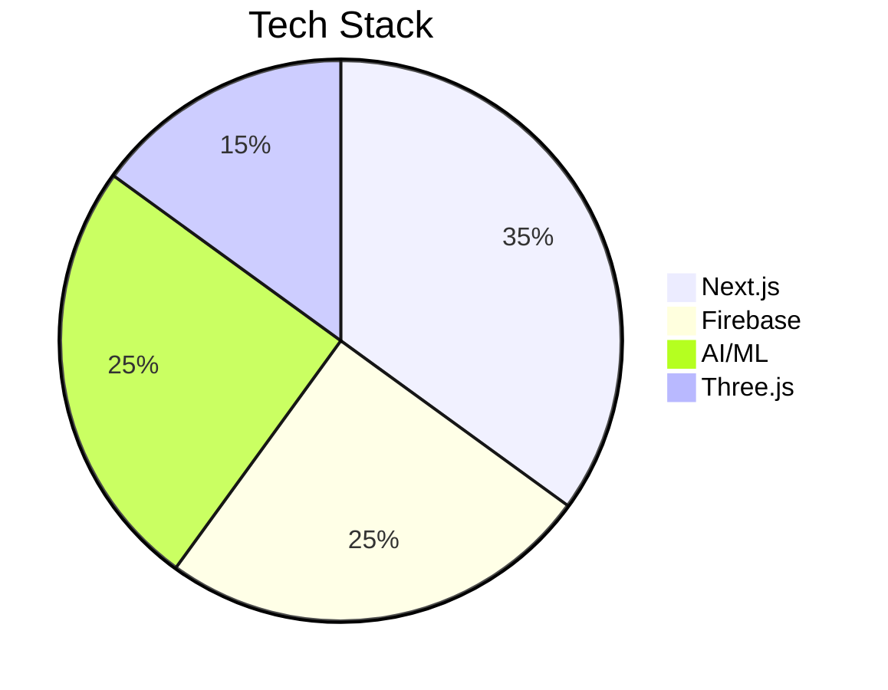
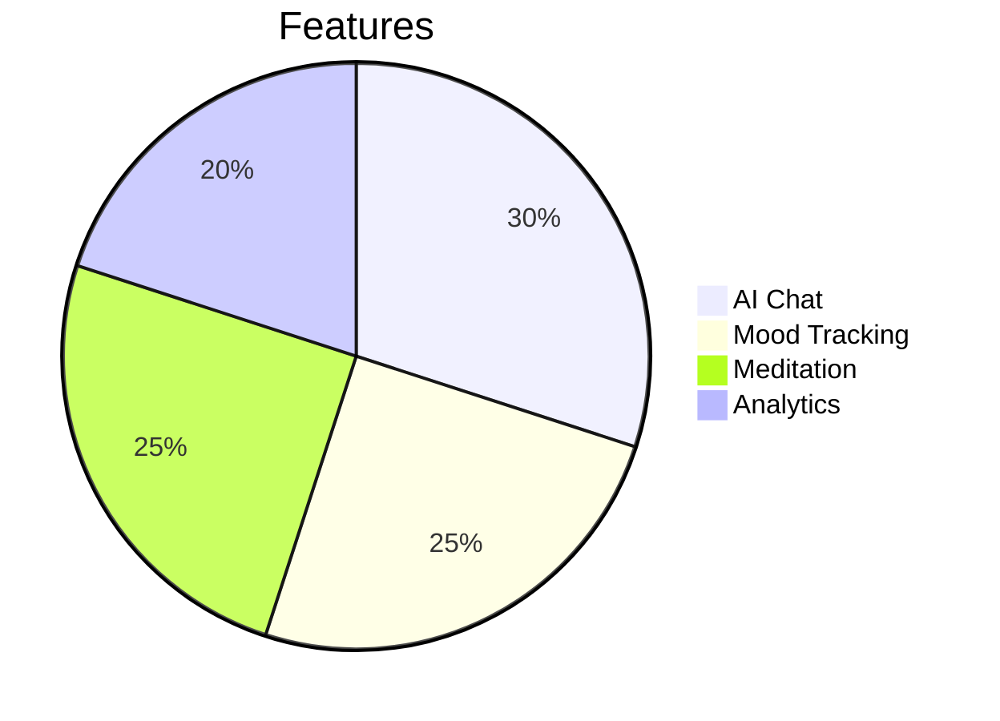
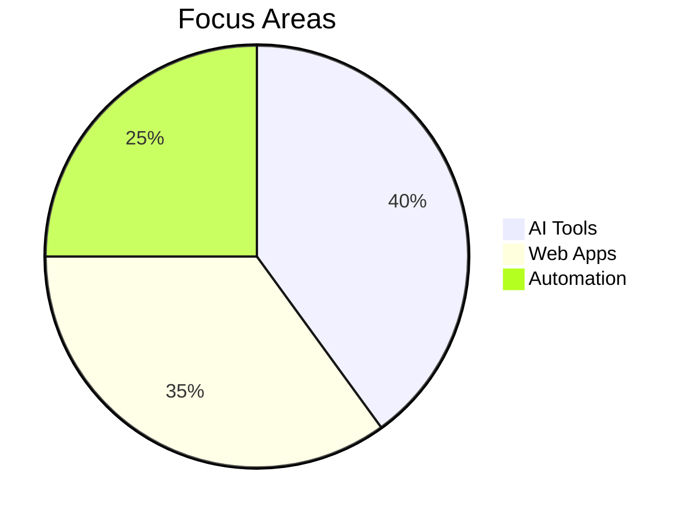

<div align="center">

<!-- Animated Header -->


<!-- Typing Animation with Multiple Lines -->
<p align="center">
  
</p>

<!-- Animated Badges -->
<p align="center">
  
  
  
</p>

</div>

---

<div align="center">

## 🧬 DNA { Developer • Innovator • Dreamer }

</div>

<table align="center">
<tr>
<td width="50%" valign="top">

### 🎯 Mission Control

```javascript
class Aditya extends Developer {
  constructor() {
    super();
    this.name = "Aditya Kumar";
    this.role = "Full Stack Alchemist";
    this.location = "Ranchi, India 🇮🇳";
    this.currentMission = [
      "🔮 Inscipe - Smart & Affordable E-commerce Platform",
      "🧘 iZEN Like - AI & Services Companion"
    ];
  }

  get dailyRoutine() {
    return {
      morning: "☕ Coffee + Code",
      afternoon: "🎯 Build & Ship",
      evening: "📚 Learn & Experiment",
      night: "🌙 Dream in JavaScript"
    };
  }

  getSkillSet() {
    return [
      "AI Integration Wizard 🤖",
      "UI/UX Perfectionist 🎨",
      "Backend Architect 🏗️",
      "Problem Solving Ninja 🥷"
    ];
  }
}
```

</td>
<td width="50%" valign="top">

### 🌈 Current Universe

```python
class CurrentlyExploring:
    def __init__(self):
        self.learning = {
            "AI_ML": ["LLMs", "Neural Networks", "Automation"],
            "Frontend": ["Next.js", "Three.js", "WebGL"],
            "Backend": ["Scalable APIs", "Microservices"],
            "DevOps": ["CI/CD", "Cloud Architecture"]
        }
        
    def life_philosophy(self):
        return """
        🎮 Game when I can
        🎬 Watch stories unfold
        🏏 Play cricket passionately
        🏐 Spike some volleyball
        💡 Code with purpose
        🚀 Ship with pride
        """
    
    def motto(self):
        print("Transform Coffee ☕ into Code 💻")
        print("Transform Code into Impact 🌍")
```

</td>
</tr>
</table>

---

<div align="center">

## 🌐 Let's Connect Across the Multiverse

<p>
  <a href="https://instagram.com/ig._.aditya._.01/">
    
  </a>
  <a href="https://linkedin.com/in/aditya-kumar-52433a359/">
    
  </a>
  <a href="https://youtube.com/@inscipe_shop">
    
  </a>
  <a href="https://pinterest.com/aditya_k001">
    
  </a>
  <a href="mailto:inscipe@gmail.com">
    
  </a>
</p>


</div>

---

## 🎨 Tech Palette & Toolbox

<div align="center">

### ⚡ Core Languages
<p>
  
</p>

### 🚀 Frameworks & Libraries
<p>
  
</p>

### ☁️ Cloud & Infrastructure
<p>
  
</p>

### 🗄️ Databases & Backend
<p>
  
</p>

### 🎨 Design Arsenal
<p>
  
</p>

### 🛠️ DevOps & Tools
<p>
  
</p>


</div>

---

<div align="center">

## 📊 GitHub Constellation


</div>

<div align="center">
  
  
</div>

<div align="center">
  
  
</div>

<div align="center">
  
</div>

---

<div align="center">

## 🎯 Current Missions & Quests

<table>
<tr>
<td align="center" width="33%">

### 🛍️ Inscipe
*Trendy & Affordable Ecommerce Platform*


**Status:** 🟢 Active Development

</td>
<td align="center" width="33%">

### 🧘 iZEN Like
*AI & Services*


**Status:** 🟡 Beta Phase

</td>
<td align="center" width="33%">

### 🚀 Future Projects
*Coming Soon*


**Status:** 🔵 Planning

</td>
</tr>
</table>


</div>

---

<div align="center">

## 🏆 Achievements & Milestones


<table>
<tr>
<td align="center" width="25%">

<br><strong>Projects Built</strong>
<br><h3>15+</h3>
</td>
<td align="center" width="25%">

<br><strong>Problems Solved</strong>
<br><h3>200+</h3>
</td>
<td align="center" width="25%">

<br><strong>Coffee Consumed</strong>
<br><h3>∞</h3>
</td>
<td align="center" width="25%">

<br><strong>Lines of Code</strong>
<br><h3>50K+</h3>
</td>
</tr>
</table>


</div>

---

<div align="center">

## 💭 Random Dev Wisdom


### 📈 Coding Journey


</div>

---

<div align="center">

## 🎮 Beyond the Code

<table align="center">
<tr>
<td align="center" width="25%">

<br><strong>Gaming</strong>
<br><sub>Strategy & RPGs</sub>
</td>
<td align="center" width="25%">

<br><strong>Movies</strong>
<br><sub>Sci-Fi & Thrillers</sub>
</td>
<td align="center" width="25%">

<br><strong>Cricket</strong>
<br><sub>Weekend Warrior</sub>
</td>
<td align="center" width="25%">

<br><strong>Volleyball</strong>
<br><sub>Team Player</sub>
</td>
</tr>
</table>


</div>

---

<div align="center">

## 🎵 Spotify Playing

[](https://open.spotify.com/user/31k6txgreanzii6s7qgryedaqgmq)

</div>

---

<div align="center">

## 🐍 Watch My Contribution Snake Eat My Commits!

<picture>
  <source media="(prefers-color-scheme: dark)" srcset="https://raw.githubusercontent.com/ADITYA-K007/ADITYA-K007/output/github-contribution-grid-snake-dark.svg">
  <source media="(prefers-color-scheme: light)" srcset="https://raw.githubusercontent.com/ADITYA-K007/ADITYA-K007/output/github-contribution-grid-snake.svg">
  
</picture>


</div>

---

<div align="center">

## 💌 Let's Build Something Legendary Together!

<p>
<strong>🌟 Open for collaborations, innovations, and coffee chats!</strong>
</p>

<p>
  
  
  
</p>

### 💡 Remember: Every Expert Was Once a Beginner

**⭐ If you find my work interesting, drop a star!**  
**🤝 Let's connect and create magic!**

---


*"First, solve the problem. Then, write the code."* - John Johnson

**Made with 💙 and lots of ☕ by Aditya Kumar**

</div>
