<div align="center">

# 🌟 Aditya Kumar

### ✨ Developer | AI Enthusiast | Creator

[](https://git.io/typing-svg)

</div>

---

## 🚀 About Me

```typescript
const aditya = {
    role: "Full Stack Developer & AI Explorer",
    currentlyBuilding: ["Inscipe", "iZEN Like"],
    exploring: ["AI/ML", "Frontend Mastery", "Backend Architecture"],
    interests: ["🎮 Gaming", "🎬 Movies", "🏏 Cricket", "🏐 Volleyball"],
    philosophy: "Code with passion, create with purpose",
    lifegoal: "Transform ideas into impactful solutions"
};
```

<div align="center">

### 💡 **What Drives Me**

Creating **intelligent tools** that make life easier • Building **web experiences** that users love • Exploring the **intersection of AI and development** • Turning **coffee into code** ☕

</div>

---

## 🌐 Connect With Me

<div align="center">

[](https://instagram.com/ig._.aditya._.01/)
[](https://linkedin.com/in/aditya-kumar-52433a359/)
[](https://youtube.com/@inscipe_shop)
[](https://pinterest.com/aditya_k001)
[](mailto:inscipe@gmail.com)

</div>

---

## 🛠️ Tech Arsenal

<div align="center">

### 💻 Languages & Core


### 🚀 Frameworks & Libraries


### ☁️ Cloud & Deployment


### 🗄️ Database & Backend


### 🎨 Design & Creativity


### 🔧 Tools & Workflow


</div>

---

## 📊 GitHub Analytics

<div align="center">


### 📈 Contribution Graph


</div>

---

## 🎯 Current Focus

```mermaid
graph LR
    A[🧠 AI/ML] -->|Learning| B[🚀 Innovation]
    C[💻 Full Stack] -->|Building| B
    D[🎨 UI/UX] -->|Designing| B
    B --> E[✨ Impactful Products]
```

<div align="center">



</div>

---

## 💭 Dev Wisdom

<div align="center">


</div>

---

## 🎮 When I'm Not Coding

<div align="center">

🎬 Binge-watching sci-fi & thrillers | 🎮 Gaming marathons | 🏏 Cricket under the sun | 🏐 Volleyball with friends

</div>

---

<div align="center">

### 💫 Let's Build Something Amazing Together!


**⭐ Star my repositories if you find them interesting!**

---

*"The best way to predict the future is to create it."* 

</div>
